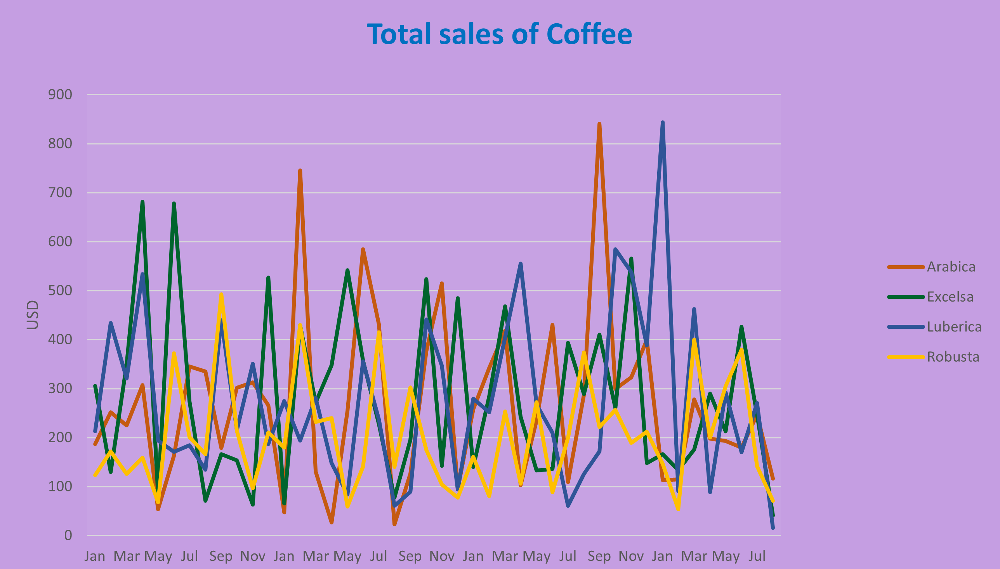
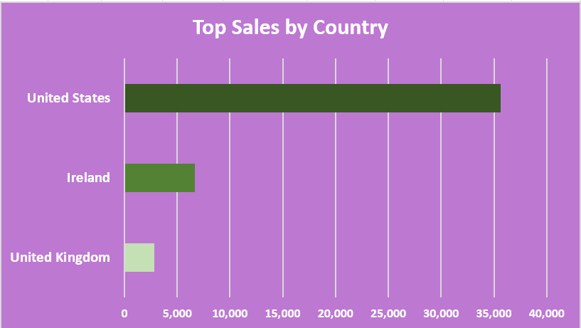
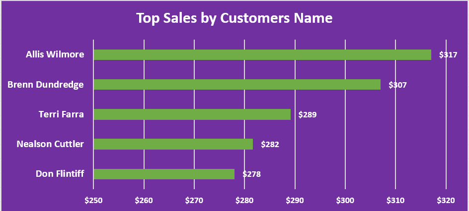

# Coffee-Sales-Dashboard-Data-Analytics-by-Excel

---

## Introduction
This Coffee Sales dashboard was created to help ManagerS investigate sales of coffee,by Coffee name, country and, by Customers names.
The data is from my Excel document, which provides a foundation in analyzing data using this powerful tool. The data contains detailed information on Order ID,Customer ID,CustomerS Name,Coffee Type Name etc and essential skills that are presented here.

## Dashboard File
My final [dashboard](https://github.com/Othmane-data/Coffee-Sales-Dashboard-by-Excel/blob/main/coffeeOrdersData.xlsx)

## Problem statement
1. What is the total sales of coffee by years ,mounths and Coffee type name?
2. What is the top sales of Coffee in dollars,by Country?
3. What is the top 5 sales of Coffee by Customers name?

## Skills/ concepts demonstrated
- 🧮 Formulas and Functions
- 📉 Charts and Visualization
- ❎ Conclusion and Recommendations


### 🧮 Formulas and Functions:
- Customer Name,Email,Country;
```
- Customer Name=XLOOKUP
  (C2,customers!$A$1:$A$1001,
    customers!$B$1:$B$1001,,0)
  
- Email=IF
  (XLOOKUP(C2,customers!$A$1:$A$1001,
    customers!$C$1:$C$1001,,0)=0,"",
      XLOOKUP(C2,customers!$A$1:$A$1001,customers!$C$1:$C$1001,,0))

- Country=XLOOKUP
  (C2,customers!$A$1:$A$1001,
    customers!$G$1:$G$1001,,0)
```
  
- Coffee Type,Roast Type,Unit Price;
```
- Coffee Type=INDEX
(products!$A$1:$G$49,
  MATCH(orders!$D2,products!$A$1:$A$49,0),
    MATCH(products!$B$1,products!$A$1:$G$1,0))

-Roast Type=INDEX
(products!$A$1:$G$49,
  MATCH(orders!$D2,products!$A$1:$A$49,0),
    MATCH(products!$C$1,products!$A$1:$G$1,0))

-Unit Price==INDEX
(products!$A$1:$G$49,
  MATCH(orders!$D2,products!$A$1:$A$49,0),
    MATCH(products!$E$1,products!$A$1:$G$1,0))
```

### 📉 Charts and Visualization:
The report comprises 3 charts:

___1. Top Sales Of Coffee;___

___2. Top Sales By Country;___

___3. Top Sales By Customers Name.___

we're use the pivot table for every shart

__- Features:__
- Order Date by Mounth Timeline;
- Size Slicer;
- Roast Type Name Slicer;
- Loyalty Card Slicer.

You can view the all dashboard [here](coffeeOrdersData.xlsx)

___1. Top Sales Of Coffee:___



_There is a significant range of every coffee type name in all periods, but Arabica and Luberica register a highest worth between juin 2021 and febrary 2022 with 841 $ and 844 $ . 🤓_

___2. Top Sales By Country:___



_United states is the major coffee consuming country for our store with a total sales over than 35 000 $._

___3. Top Sales By Customers Name:___



_Allis Wilmore is the first customer consuming coffee at our store with a turnover of more than 317 $_


### ❎ Conclusion and Recommendations:

Illinois has the highest impact on income although relatively negligible.
There are 128 products in the stores with a worth of 140 million dollars. 😄
#Recommendation: For a deep dive into the analytics, the datasets of the previous years will be required for comparison and data driven decision making.

